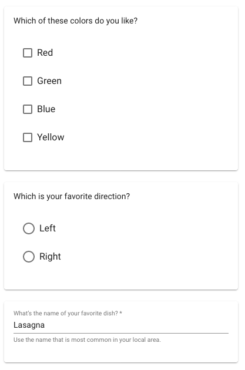
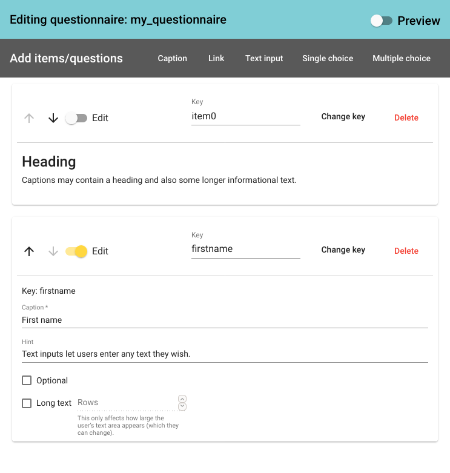

# [fɪʃ]

fish-public-frontend is one of three parts of the [fɪʃ] suite. Fish lets you
create online forms/questionnaires using a simple graphical interface and then
host them on-prem (i. e. on your own servers). User responses are collected in
a table and can be viewed online or downloaded as CSV files.

## The components

The [fɪʃ] suite comprises a backend and two distinct frontends. For
authentication, it relies on [OpenID Connect](https://openid.net/), with
[Keycloak](https://www.keycloak.org/) being the tested and recommended
implementation.

The two frontends are the fish-admin-frontend and the fish-public-frontend. The
public frontend retrieves questionnaires from the backend and renders them. It
lets users complete those forms and submit them to the backend. The backend,
upon receiving a completed questionnaire, saves the data to a flat-file database
and sends a confirmation email to the user and the owner of the questionnaire.
The public frontend is also used by administrators to pick the items on the
questionnaire. The separate admin frontend is used by administrators to see user
responses, create new questionnaires, type the confirmation email texts and
managing some other details.

## Supported types of questionnaires/forms

The [fɪʃ] suite allows text input fields, single choice and multiple choice
questions. Text input fields can be marked optional.

## The editor

The fish-public-frontend includes a simple GUI editor that can be used to add,
change and re-arrange items. Each item is given a key that determines the column
heading under which the response will later be found in the table (or CSV file)
of results.

## The Fish API

Communication between the backend and the two frontends utilizes a REST API. A
description of the API is available in the OpenAPI v3 format. It is a part of
the fish-backend repository.

The description file: <https://github.com/MJochim/fish-backend/blob/master/fish-api.yaml>

Use Swagger UI to visualize the API: <https://petstore.swagger.io/?url=https://raw.githubusercontent.com/MJochim/fish-backend/master/fish-api.yaml>

## Installation and configuration

To install an instance on your own server, you need a web server and an OpenID
provider (e. g. [Keycloak](https://www.keycloak.org/)).

fish-public-frontend uses the Angular framework and must be configured and built
locally before deploying it to the server. The build process basically amounts
to `npm install && ng build`.

fish-admin-frontend does not need a build process. It can be configured and then
uploaded to a web server as is.

fish-backend must be set up correctly on the web server.

In Keycloak, you must set up a confidential client for fish-backend and a public
client for the two frontends (they share one client). The client for
fish-backend must have its service account enabled and that service account
needs to be permitted to add client roles to the other client; currently this
means that it needs the `manage-client` role in the respective realm.

A detailed installation guide will be added in the future. Get in touch if you
need advise or want to make the guide happen more quickly ;-).

## Author

The [fɪʃ] suite was developed by Markus Jochim for the association
[Junge Sprachwissenschaft e. V](https://www.junge-sprachwissenschaft.de/en/).
It is licensed under the terms of the
[GNU AGPLv3](https://www.gnu.org/licenses/why-affero-gpl).

## Hosting

Junge Sprachwissenschaft e. V. (recognised in Germany as a “gemeinnütziger
Verein”) also offers to host questionnaires for you, especially if you are a
student (group) in a linguistics-related field. While this, to some degree,
defeats the purpose of self-hosting, it can be more appropriate than
resorting to commercial hosting providers. Get in touch if you are interested:
<https://www.junge-sprachwissenschaft.de/en/contact/>
